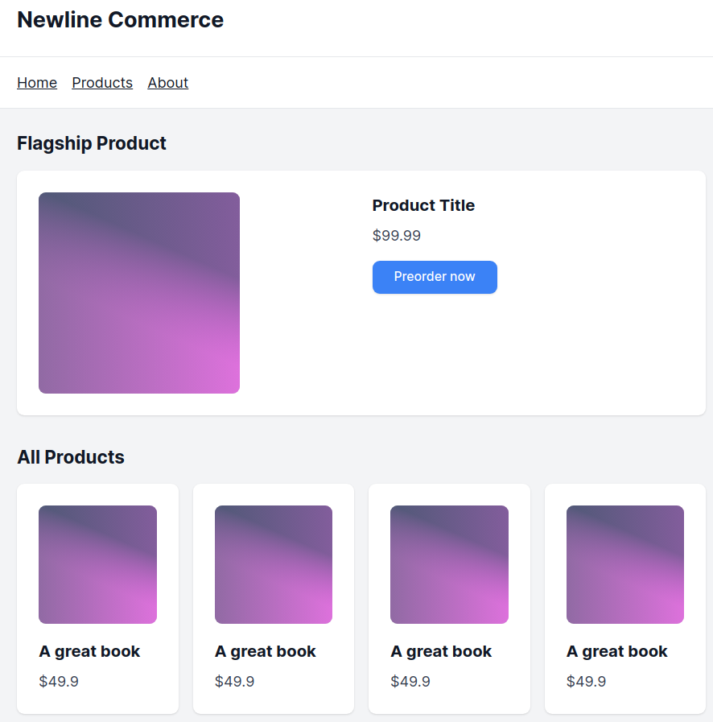
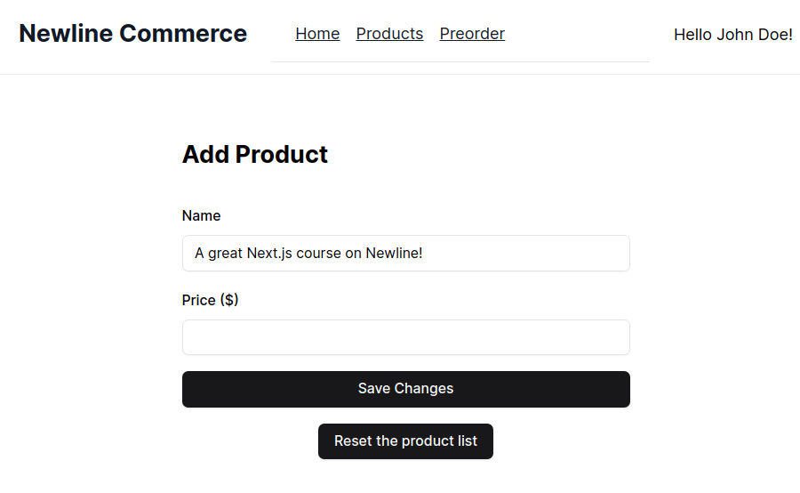

## Prerequisites

Welcome to this Next.js course!

To fully benefit from this course, you should have some experience with frontend web development, ideally with a modern framework like React or equivalent, and a good understanding of the HTTP request/response lifecycle.

If you don't feel confident enough yet,  that's not a problem at all! 
I would recommend checking out the [Next.js Learn](https://nextjs.org/learn) tutorial and [State management course on Newline from Fernando Doglio](https://www.newline.co/courses/complex-state-management-with-server-and-client-components-in-next) first.

If you are familiar with web development but not with React specifically, you can also check the [React Foundations](https://nextjs.org/learn/react-foundations) course from [Vercel, and Full Stack React Book](https://www.newline.co/fullstack-react), [TinyHouse](https://www.newline.co/tinyhouse) or [Fullstack React with Typescript](https://www.newline.co/courses/fullstack-react-with-typescript-masterclass) 

## Building an ecommerce website and more

This course will teach you powerful patterns to create blazing fast Next.js applications using the latest paradigm shift in React: React Server Components (RSC). Static rendering is often underrated: it’s very fast, very cheap, but hard to use in advanced scenarios. This course introduces students to personalization with static rendering. These advanced patterns introduces concepts like Server Action and static rendering in a way that students won’t find in the documentation.

Specifically:
- What are the tools at our disposal in Next.js 14 App Router to craft content websites: React Server Components (RSC), Server Actions, and the 3 rendering techniques
- How to use revalidation on static page to display up-to-date data, and still benefit from the performance of static
- How to “relay” a server render and a client render to get the best of both worlds
- How to mix static and dynamic server-side rendering to further personalize the user experience, while keeping the page static and fast

Here is a screenshot of Newline Commerce homepage, our demo application for this course. Ecommerce websites are content applications: they display lists of products stored in a database. Blogs, news websites are also content applications. Next.js is **excellent** for this use case.

Here is a demo of the first version of the application in action:

<ReplitEmbed
  src="//replit.com/@newlineauthors/blazing-fast-app-v1"
/>

This course is about building content websites need to be highly performant, scalable, and cost effective for SEO or ecommerce purposes but want to keep the pesonalization that everyone loves. Some people have even gone into static oriented frameworks like Qwik. Not only will this apply to any content application but also it will apply to dashboards or multi-tenant SaaS.

At the end of this course, you should be able to craft content applications that load immediately, that scale up well, and has instant updates when adding a product or preordering the flagship product.

These new skills will allow you to make Next.js apps with dynamic content (blog, ecommerce, press website) faster to load and more efficient, while guaranteeing that they display up-to-date information at all-time.

## Craft all kinds of content applications

Ecommerce is a great example to understand content applications, because there is a direct relation between the code we write and the revenue it generates. 

But that’s not the only one: blogs, media websites, company websites are content websites that works very similarly to ecommerce under the hood.

Instead of listing products, you may need to list articles or authors, instead of preorder forms, you may want users to subscribe to a newsletter, etc.

All these websites need to load and display fresh data as quick as possible.

:::info
[Lee Robinson's blog](https://leerob.io/blog/2023#performance) (VP of Product at Vercel) uses React Server Components and Partial Prerendering, two concepts we will explore in this course.
:::

## Newline E-Commerce features

Let's put ourselves in the shoes of an e-commerce business owner who wants to sell products online. The owner wants to create a preorder that needs to handle a lot of traffic from reddit, press and other places, but they don't just want a static landing page. 

Here are the requirements for our demo application:

- The homepage should highlight a flagship product, one that the owner intends to promote heavily. 

- Users should be able to pre-order the flagship product, with the call-to-action count increasing in real-time as pre-orders are made.

- The homepage will also display a comprehensive list of products. 

- The product list will be available on a specific "/products" page too

- In addition to the customer interface, the application should include an administration area. This area will let the e-commerce owner create new products. 

Our goal as developers is to ensure that the e-commerce site is not just performant, scalable, and efficient but also dynamically responsive to data changes.

:::tip
Pro-tip: I generated the UI components for this demo app using [Vercel v0](https://v0.dev/)! It's great if you want to quickly build your own app and focus on the architecture rather than the UI.
:::
