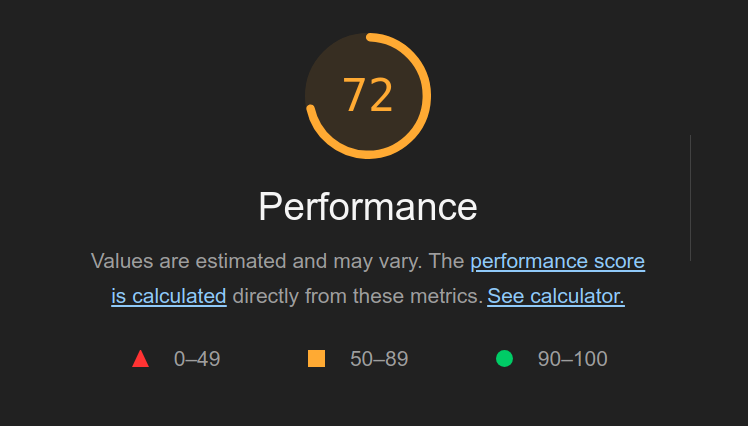

## Performance Matters

Ecommerce is a highly competitive sphere with a vast array of players. For a website to be successful in this environment, it needs to be more than just functional; it must also be fast and performance-optimized. There are not only penalties from SEO. People are imperceptibly impatient with websites. To the point where it affects conversion and if the site is big. It can be millions of dollars. 

There is a crucial correlation between a website's **performance** and its potential to generate revenue.

That's why it's essential to prioritize optimization when developing an **e-commerce** website but more broadly any kind of content website.

Here is the Lighthouse audit for Amazon, on a page that lists React related books. Not bad for a site this scale but let's try to do better with Next.js!

## Performance should be the default

Having a website that is properly functioning is of course the first priority, and that’s already a lot of work for the developer!

But for a business owner, a working website is actually the bare acceptable minimum. Put yourself into the shoes of a website owner: you want it to generate publicity, leads, traction, and eventually revenue. Not just code.

Developers and business owners operating professional websites in larger organizations will definitely care about this. 

But smaller businesses are also affected, positively or negatively, by the SEO or overall quality of their websites.

In Next.js, performance is the default when you start developing a new application. And with the little tricks I'll teach you in this course, you'll be able to max out performance for bigger apps too.

## Not convinced?

Various studies have shown an undeniable relationship between a website's performance and its conversion rate.

Here are some numbers found in the wild:

- A famous study from [Akamai](https://www.akamai.com/site/en/documents/white-paper/how-web-and-mobile-performance-optimize-conversion-and-user-experience-white-paper.pdf) has shown that a 3 seconds delay will make you lose half of your visitors.

- [Walmart](https://www.cloudflare.com/learning/performance/more/website-performance-conversion-rates/) has noticed that on the contrary, each second won increased conversions (not just visits but actual sales!) from 2 points.

- 100ms of latency costs Amazon [1% in revenue](https://www.gigaspaces.com/blog/amazon-found-every-100ms-of-latency-cost-them-1-in-sales) Since Amazon's current revenue is about 554B. That equates to 5.5B in lost dollars just due to performance. 

- At the worst stage of the “JavaScript era” (2010-2020), the average mobile web page was taking 15.3 seconds to load according to Google Research.  If 3 seconds makes you lose half of your customers, imagine 15 seconds!

- According [to research](https://www.researchgate.net/profile/Jan-Vom-Brocke/publication/350600983_On_Latency_of_E-Commerce_Platforms/links/6140f08d578238365b0b0cec/On-Latency-of-E-Commerce-Platforms.pdf), mobile users are even more affected by latency. In a world where half your visitors might come from a mobile or tablet, that’s really an issue.

Even if you just want to code your own personal website. You want to show pride in your work and show respect for your visitors time.  

We may have gotten used to slow softwares but it doesn’t have to be this way, all the more that Next.js makes it actually very simple (read: it doesn’t need a lot of code) to have an extremely efficient website.
