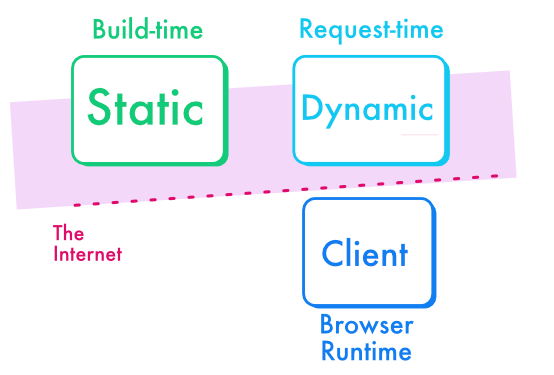

## The 3 rendering techniques

In Next.js, performance is tightly related to the method chosen to render content on a webpage. That's why this course will talk a lot about "Static Rendering", a very performant approach.

From a technical standpoint, there are 3 ways of rendering content in React and Next.js allows all of them:

- **Static**, aka build-time rendering or SSG: the server computes the HTML ahead of time. When a URL is opened, ready HTML content is promptly sent to the user.

- **Dynamic**, aka request-time rendering or SSR: for each request to a given URL, the server computes the full HTML for the page and returns it. This approach can be resource-intensive for sites with high traffic.

- **Client-side**, aka CSR: JavaScript in the browser takes care of updating the content. This method requires downloading the webpage JavaScript code and executing it, which may create a delay compared to SSR. However, CSR can be used in conjunction with server-side rendering to enhance interactivity.

:::note
Static rendering is my favourite and after this course it will be yours too!
:::

### Where and When

The best way to remember them is in term of “where” and “when”. The “where” can be either the client or the server. For server specifically, the “when” can be either build-time, or request-time when the users access the site. Client renders happens after that, when the app is loaded in the user’s browser.

| Mode | Where | When |
|--|--|--|
| Static | Server-side | Build-time |
| Dynamic | Server-side | Request-time |
| Client | Client-side | When JS is loaded in the browser (~ request-time or interactively) |

The diagram belows illustrates how I see them. Both dynamic and static happens on the server, but static happens at build-time. Then client-side rendering happens when the page is loaded.

## The client-side era

During the last decade (2010-2020), developers have explored client-side rendering extensively. Powerful user devices, be they mobile or desktop, and feature-rich browsers, have enabled extremely interactive websites whose code run directly in the browser. Some of them were literally softwares in the browser, aka SaaS or SPAs, a new and successful way to distribute software to the end users.

But those apps also suffer from performance limitations: need to download a massive JavaScript bundle before seeing content, relying on the end user CPU for computations which leads to an unfair access to the web.

Two steps ahead, one step behind: good old server-rendered applications did not suffer from all those new evils!

## The Power of Static Rendering

Dynamic rendering or "SSR" is the opposite of client-side rendering. The page content is computed server-side, for each new request. But it's costly, because your server has to do the computations.

Static rendering is a powerful tool that can yield a high-performance website: it simply computes the render ahead of time. 

It's often underestimated, with many developers believing it to be quite restrictive. However, when utilized skillfully, static rendering can significantly optimize web performance, providing a fast, efficient, and user-friendly experience.

In the context of building an e-commerce website, static rendering can be used to great effect. Product pages, for example, can be pre-rendered at build time, allowing for fast load times and an improved user experience. 

:::note
No, Static Rendering is not limited to public content, and it is not limited to content that never changes either. If someone says that, share them this course!
:::
 
## Hybrid apps

The current decade (2020-2030) is dedicated to hybridization between the client and server rendering. We want to keep the best of both worlds, with maximum flexibility. 

Content websites are hybrid by nature:

- they must both display a lot of content (text, images, videos… a good fit for server-side rendering) 
- and allow complex interactions (dynamic widgets, complex forms, processing payments… better handled with client-side rendering) 

:::info
Swyx, a well known developer and investor, described this [“3rd age of JavaScript”](https://www.swyx.io/js-third-age) from a tooling standpoint, but also includes the idea that content should ideally be server-rendered, at build-time, whenever possible.
:::

Figuring the right type of render for an application is important as it impacts performance a lot (static is way cheaper than dynamic) and can change the code a lot especially when switching from server-side rendering to client-side rendering.

Each method has its advantages and trade-offs, and the choice largely depends on the nature of your website and its content. This course is about providing you relevant patterns to adress real-life situations.

## More resources

Check Next.js [official documentation](https://nextjs.org/docs/app/building-your-application/rendering) related to rendering.
