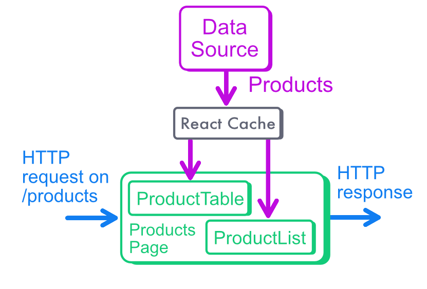

## React Server Components are living... on the server!

A React Server Component is rendered server-side, and only server-side. This means that it can communicate directly with other server-side technologies, like databases, or public and private APIs.

RSCs stand out because they can be asynchronous and use the `async/await` syntax directly. 

Remember that this is not currently the case in Client Components. You need a combination of `useEffect`, `useState` and `fetch` to get data client-side, which is very verbose and cumbersome. 

In the future, there might a `use` hook (yes, just "use") for Client Components but it will still not use the `async/await` syntax directly.
This [RFC](https://github.com/acdlite/rfcs/blob/first-class-promises/text/0000-first-class-support-for-promises.md) gives more insights about how asynchronous code is supposed to be handled in React 18.


So, how do we get data from a React Server Component? **We just get it**. Calling `await fetchMyData()` is all you need!

```jsx
// /!\ This component cannot be imported client-side
// Because of its server-side requirements
async function HelloWorldAsync() {
  // fetchHelloText() can call the database
  // or open a file on the server
  // or trigger an HTTP call
  // etc.
  const hello = await fetchHelloText()
  return <p>{hello}</p>
}
```

:::note
RSCs that make use of server-side features and asynchronous calls cannot be imported in client-side code. If you need an RSC to be a child of a client component, use [interleaving](https://nextjs.org/docs/app/building-your-application/rendering/composition-patterns#interleaving-server-and-client-components).
:::


## Static as a default

When the data are not dependent on the current request, Next will use static rendering. 

For instance, the list of products of our ecommerce doesn't depend on the current user. So we don't need to read the request cookies or headers to check who is the current caller.

Since we don’t use any interactive features (that materialize by using hooks in React like `useState`, `useEffect`, `useRef` to manipulate DOM or state), the `ProductList` component can be an RSC.

```tsx
// src/components/product-list.tsx
async function ProductListAsync() {
  // see: it just gets data!
  const products = await rscGetProducts()
    return (<div>
      {
        products.map((product, idx) => {
          return <ProductItem key={idx} product={product} />
        })
      }
    </div>)
}
```

This means it will have the best possible performances, no client-side JavaScript, everything computed ahead of time at build-time. Great!

## Suspense and asynchronous components

React's `Suspense` component can handle the loading stage of asynchronous components. It renders a fallback UI until the promise resolves.

You don't see it, but Next.js App Router automatically adds a Suspense at the top of your application.

You can also use Suspense yourself to wrap some specific components down the tree. We do that in Newline Commerce to show a loading message while we retrieve the product.

```jsx
// src/components/product-list.tsx
export function ProductList() {
  return (
    <Suspense fallback={"Loading the latest products..."}>
      <ProductListAsync />
    </Suspense>
  )
}
```

In the case of static rendering, the fallback UI will never actually be shown because the data is never "loading" in the application.

That's the true power of static rendering: zero loading time, visible or not, for your end user!

## Fetching with HTTP, or calling the database directly

There are actually 2 different scenarios when fetching data from an RSC.

### 1) The HTTP scenario

If you call an external API via its URL, you can trigger an HTTP request using a `fetch` call. Next.js handles deduplication for us, and [patches the `fetch` function](https://nextjs.org/docs/app/api-reference/functions/fetch) with more options if you need more control.

```jsx
async function CallStripe() {
  // Please add more robust error handling logic here :)
  const payments = await (await fetch("https://api.stripe.com").json()
  return <div>{payments}</div>

}
```

Next.js will also patch the fetch functions of your application dependencies. If you use a "serverless" database like Upstash, and you use the `@upstash/redis` package to get data, you are still in the "fetch" scenario even if the actual fetch call is hidden from you.

:::note
Keep in mind that you cannot trigger `fetch` calls to the API of your own Next.js application, because it might not be running during build-time. Instead, you can just reuse the code of your API endpoint and call your data source directly. See the "database scenario" below.
:::

### 2) The database scenario

RSCs can use server-side logic like Node.js `fs` or database clients to get the data directly, without needing to call an intermediate API.

```jsx
// Example component that calls a Mongo database directly
export async function CallMongo(){
  const db = await dbClient()
  // Be careful: if you need products in multiple place,
  // you'll need to setup memoization with "cache"
  const products = await db.products.find({})
  return <div>{products}</div>
}
```

If you access the database directly, or read some files, or basically anything that is not an HTTP call to an API using `fetch`, you need to think about deduplication/memoization. Remember to use the `cache` wrapper function, because the data fetching function could be called by multiple components on the same page. 


```tsx
// src/fetchers/products.ts

// A function that calls my database directly
// Maybe multiple components need to show the product list
import { getProducts } from "@/db/products";

// The cached version, safe to use in a RSC 
// (the "rsc" prefix is a trick of mine)
export const rscGetProducts = cache(getProducts)
```


## And why do we need this cache, by the way?

A page in Next.js should always be seen as the root of a tree made of components. 

In a complex application, each component can render a few more, leading to hundreds of them in a page. 

It’s highly probable that some of them will query the same data. For instance, the name and profile picture of the author of a blog post could be displayed at the top of the article, but also on the side with their biography. Or the product list can be used in multiple places.


In the example below, we have a page that renders products in two different ways: a table, and a list. Both components of the same page need to load products, so React `cache` will kick in.



Corresponding code:

```jsx
export async function ProductsList() {
    const products = await rscGetProducts()
    return <ul>{...}</ul>
}
export async function ProductsTable() {
    const products = await rscGetProducts()
    return <table>{...}</table>
}
export function ProductsPage({view}) {
  // Both components need the same data!
  // Memoization with "cache" prevents a duplicate call
  return (<div>
    <ProductsList />
    <ProductsTable />
  </div>)
  
}
```

The `cache` wrapper function guarantees that we call the database (or whatever your data source is) only once per page for the same data, even if multiple components need them.

Without this function, rendering a single page can potentially trigger multiple, redundant requests to your database fetching the exact same data. The impact on your infrastructure can be disastrous when many components need the same data, for instance items of a big list.

:::info
You don't need to wrap fetch calls with "cache", Next.js already deduplicates fetch calls for you.
:::

:::tip
The `cache` function can be seen as an equivalent to the client-side React `Context`, but for RSCs.
I detail this idea more thoroughly in this [Stack Overflow answer.](https://stackoverflow.com/questions/66106408/retrieve-data-server-side-and-save-in-context-with-next-js/75533592#75533592)
:::

## Is it safe to call a database from a React Server Component?

Directly communicating with the database from React, and then passing the data to the client, can be unsettling due to security issues.

If you worry about security, Next.js core contributor Sebastian Markbåge recently published [a blog post](https://nextjs.org/blog/security-nextjs-server-components-actions) explaining the best practices. 

The solution consists in creating a separate data layer for the application. Basically you'll want to keep your data loading code isolated to facilitate audits, and use Next.js “default” approach (RSC, Server Actions) as much as possible.

:::tip
I prefix all the cached and safe data-fetching functions with “rsc”. 
When I see `rscGetProducts()`, I know this function is safe to use in terms of security and performance!
:::

We have covered the asynchronous nature of React server components and their capability to fetch data directly from databases or other APIs using the `async/await` syntax.

Fetching data is great, but now let's discuss about updates with Server Actions.
