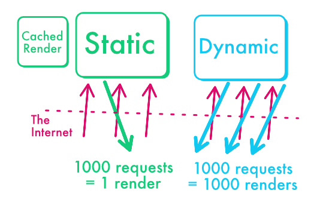

## A fresh list of products

In previous lessons, we have learnt how to retrieve data from a database and render it using React Server Components. 

We have also explored how to create a form in the administration interface to update data without involving client-side JavaScript. 

One of the issues with this code is that statically rendered pages do not update automatically when data in the database changes.
Static pages are rendered ahead of time during compilation, and they do not update automatically. 

We'd like the list of products to be refreshed whenever the ecommerce owner adds a new product, so that new visitors can see, and buy this product. 

## Should we use dynamic rendering?

Does the requirement for fresh data means we must go from static (build-time) to dynamic (per-request) rendering, in order to get the latest product list from the database on every user request?

:::tip
The answer is no.
:::

Our website seems to be a good fit for static:

- Almost all the content of the ecommerce website is identical for all users
- The product catalog changes only when the ecommerce owner updates it manually
- Some data are more dynamic, like a number of preorders, or the users info, but they are limited to small areas

Rendering dynamically on the other hand would be overkill. For instance, an e-commerce owner might add a new product once a day. With dynamic, per-request rendering, all the site visitors will trigger new renders during this interval, eventhough the product list did not change. 

This is inefficient considering that the product list changes only when the owner adds a new product.

What we want is therefore not exactly “dynamic” (1 request = 1 render), but instead “static that should update from time to time” (1 database update = 1 render). 

On content websites, you often have more requests than content updates, so you should usually prefer the “static with updates” approach, also known as **static revalidation**.

We will see in the next two lessons how to solve this issue with `revalidatePath` and `revalidateTag`.

## Evaluating perfs using a load test

To better understand why static rendering is preferred, let's run an experiment. A load test simulates a high volume of requests to the server. Here, we are using the [loadtest package](https://www.npmjs.com/package/loadtest), and we fire the requests against a built version of the app running locally.

:::info
Ideally a load test should run against your real production server, but be careful that it may involve some costs.
Even if you run the test locally on your own computer, you need to run a production build, it is useless to load test the application in development mode.
:::

The results are quite positive, our mean response time is less than 30ms, over more than 21k requests.

This experiment proves that our app is currently optimal: since there are no new renders, it can send the product list to users in less than 100ms! 

Much better than the 15 seconds Google measured on average on mobile websites that use massive amount of client-side JavaScript.

## "Static + updates" versus "Dynamic + caching"

At this point, some might think that, instead or relying on static rendering, we could use dynamic rendering but cache the results using the HTTP cache via the [“Cache-Control” header](https://developer.mozilla.org/fr/docs/Web/HTTP/Headers/Cache-Control). 

That’s mostly true, formally dynamic rendering with Cache-Control is equivalent to caching the page at the “network” level, while static rendering caches the page at the “application” level. 

But I’ve explored this direction and this approach actually have slight limitations compared to static rendering. To sum it up, static can handle personalized content while dynamic + HTTP cache cannot. 

You can read more on this topic in my article ["Treat your Users right with Http Cache and Segmented Rendering"](https://blog.vulcanjs.org/treat-your-users-right-with-http-cache-and-segmented-rendering-7a4f4761b549?gi=346e79485d7a).
