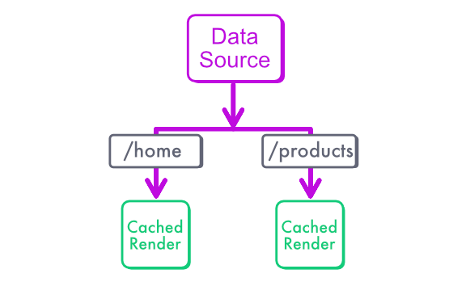

## Static Rendering for dynamic data

Static Rendering is efficient as it eliminates the need to render the product list on every request hitting our website.

However, it does present a challenge when there is a need to update the product list, such as when the ecommerce owner adds a new product. 

Thankfully, Next.js provides powerful functions to update the static page whenever a Server Action or an API call modifies the data in the database.

## Static rendering is actually a caching mechanism

When you think about it, Static Rendering is actually a caching mechanism.  We could rephrase static as “cache server-side during build-time” and dynamic rendering as “no server-side cache (cache miss)”. 

In the chart below, we have the homepage and the product list page, that are associated with a unique URL. 




Our goal here is to invalidate the server cache for pages that contain the product list, so that Next.js can compute new, fresh versions of those pages.


There should be only one render happening when we update the product list, even if we have three million users accessing the website between each product update.

## Getting fresh data is equivalent to refreshing a cache

Invalidating the static renders, and regenerating up-to-date versions is called **“revalidation”** in Next.js.

Revalidation relies on what we call a "stale-while-revalidate" strategy. The old content continues to be served to users while Next.js computes a new version for future requests. The new content becomes quickly available with no interruption, essentially updating the page in the background.

Revalidation can be done regularly, every X seconds, using the [“revalidate”](https://nextjs.org/docs/app/api-reference/file-conventions/route-segment-config#revalidate) parameter.

But there is a better way: we can invalidate pages on-demand, whenever a relevant change happens in the database!

## "revalidatePath", static rendering's best friend

The page URL constitutes a natural cache key for each statically rendered page of our application. 

Next.js allows us to invalidate these pages based on this unique URL. That’s exactly what `revalidatePath` is about. 

Whenever a server actions invalidates the data on a page, you can call `revalidatePath` for the corresponding path, as the code below demonstrates.

```tsx
// src/actions/createPreorder.ts

import { addPreorder } from "@/db/preorders";
import { validatePreorder } from "@/validation/preorder";
import { revalidatePath } from "next/cache";

export async function createPreorderAction(formData: FormData) {
    // Update our data in the db,
    // within a Server Action
    const maybePreorder: any = {
        email: formData.get("email"),
    }
    const preorder = validatePreorder(maybePreorder)
    await addPreorder(preorder)
    // Here! Our static renders will be updated
    revalidatePath("/")
    revalidatePath("/preorder")
}
```
:::tip
The "DataRevalidator" component shown in the ["Deep Dive: Caching and Revalidating" article](https://github.com/vercel/next.js/discussions/54075) allows to refresh the page automatically when users leave the tab open in their browser and focus again on it. Without it, users will only see fresh data if they refresh the tab manually.
:::

## Route segments with dynamic parameters 

If your page uses a dynamic parameter, calling `revalidatePath("/product/[product-id]")` will invalidate all product pages but will only rerender each product when they are accessed by a real. This is to prevent crashing your server by rerendering millions of products at once.

We used to call this behavior Incremental Static Rendering (ISR).

You can also invalidate a specific product by its unique id, for instance `revalidatePath("/product/1234")`

:::note
Revalidating a specific page has only been implemented [in recent versions of Next.js](https://github.com/vercel/next.js/discussions/54075#discussioncomment-6935615), you should use at least Next 14.0.
:::

## Revalidating the whole site

Now, remember that Next.js application always have a root layout, that is shared by all pages. This means that revalidating the root layout will revalidate all pages of your website, without having to rebuild it from scratch!

:::tip
Use `revalidatePath("/", "layout")` to invalidate the whole application.
:::

I’ve used this trick for the [Devographics survey app](https://survey.devographics.com/), that powers the State of JavaScript, CSS, HTML, GraphQL and React surveys ([the code is open source](https://github.com/vercel/next.js/discussions/54075#discussioncomment-6935615)). 

Many pages are built statically, and they depend from data stored on GitHub, a bunch of YAML files defining the translations, the questions for each edition of each survey… 

When any of these files is updated, GitHub triggers a request towards our apps via a webhook and then this request triggers a revalidate call. 

This way, I am sure the app is always using the latest configurations.

:::note
Static rendering is not Stale rendering!
:::

## If we need a server to rerender the static page, isn't it dynamic rendering?

Static rendering with revalidation, despite involving a server to rerender the page with fresh data, is still considered static. We talk about dynamic rendering only when **each user request** triggers a new render.

:::tip
If you want to output HTML files and serve your application from a file server or a CDN, what you need instead is a [Static Export](https://nextjs.org/docs/app/building-your-application/deploying/static-exports). 
But you won't be able to use revalidation, because you need a running server to compute the fresh renders.
:::


## How does it work under the hood

Next calls the cache used for static rendering the "Full Route Cache", because it caches whole pages. It's tightly coupled with the "Data Cache", which handles the data as its name implies.
Both are located on the server and can cache data across multiple user requests, which is the point of Static Rendering.

When we talk about caching in the context of Static Rendering, it's not exactly HTML we cache. With React Server components, it can be a JSON payload representing the data rendered by the component. 

In a nutshell, with `revalidatePath` we cache the page at build-time in the Full Route Cache (and the page's data in the Data Cache) and revalidate the content when it becomes outdated.
