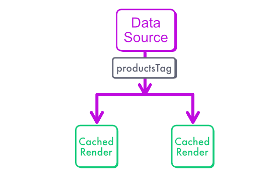

## Limitations of `revalidatePath`

In the previous lesson, we have seen that `revalidatePath` allows us to invalidate a static render and compute a new one with up-to-date data.

Relying on paths to invalidate static pages on updates means that we think in terms of “pages”. 

But our product list function is not tied to a specific page: it’s reused both on the home “/” and the “/products” pages.

This method requires us to revalidate all pages that display the product lists, which can be inconvenient if the site evolves frequently

```js
revalidatePath("/")
revalidatePath("/products")
revalidatePath("/another-page-with-products")
...
```

Rather than invalidating each page, we should probably invalidate the list itself. 

## First, we need a tag

Let's think about static rendering as a caching mechanism again. 

With `revalidatePath`, the page path (~ it's URL) was used as a cache key. Refreshing the home page is as simple as revalidating the "`/`" path.

But there is no URL tied to our `getProducts()` data fetching function, it just calls the database directly, so we don’t have a natural cache key associated to it that we can invalidate.

That’s why the first step is “tagging” our database call. The “tag” will act as a cache key that lets us tell Next the response for this database call is stale and requires a new update.

Here is a schema showing how we can invalidate both pages from a single shared tag:



## Tagging with the unstable_cache

In order to tag a data fetching function, we need the [`unstable_cache`](https://nextjs.org/docs/app/api-reference/functions/unstable_cache) from `next/cache`. We can set the “tags” option so we can later invalidate this “tag”.

```js
// src/fetchers/products.ts
import { unstable_cache } from 'next/cache'

const productsTag = "products" // a unique tag

// First step: we must "tag" the data fetching method
export const rscGetProducts = unstable_cache(
    getProducts, [], { tags: [productsTag] }
    )
```

## Tagging with fetch

Tagging with `fetch` doesn't require any unstable feature, it works fine out-of-the box in Next.js 13 and 14.


```tsx
fetch(`https://...`, { next: { tags: ['products'] } })
```

However it can be used only when your data are available via an HTTP call. For instance, fetch is relevant if you store your products in a third-party headless CMS. Here, since we call our own database to get the product list, we can't use it and we rely on `unstable_cache` instead.

:::note
The "next" option is available because Next.js [patches the `fetch` function](https://nextjs.org/docs/app/api-reference/functions/fetch#optionsnexttags) to add some custom behaviour.
:::

:::warning
You can wrap a fetch call into an unstable_cache, but that's redundant. If you use HTTP calls, no need for unstable_cache.
:::

## Invalidating data

Tagging was really the hard part: now we can just revalidate the tag in Server Actions, exactly like we did with `revalidatePath`.

The code below illustrates revalidating the list when a new product is added.

```tsx
// src/fetchers/products.ts
"use server"
import { addProduct } from "@/db/products";
import { productsTag } from "@/fetchers/products";
import { revalidateTag } from "next/cache";
import { redirect } from "next/navigation";

export async function createProductAction(formData: FormData) {
    const product: any = {
        name: formData.get("name"),
        price: formData.get("price")
    }
    // Always validate user inputs!!
    // ... validation logic here ...
    await addProduct(checkedProduct)
    // HERE: we invalidate all pages that may depend on the product list, in a single call!
    revalidateTag(productsTag)
    redirect(encodeURI(`cms?added=${checkedProduct.name}`))
}
```

## revalidateTag or revalidatePath, what to prefer?

There is a general trend in the React and Next.js ecosystem to move APIs that were only available at the page level to be accessible at the component level. This change offers more flexibility and power as components are responsible for their data lifecycle and can be reused anywhere in the application.

By adopting a component-level approach, we create a single source of truth, making the application easier to reason about and maintain. However, for many websites, thinking in terms of pages might be more intuitive and sufficient, especially for simpler applications like blogs or news websites.

In a way, `revalidateTag` is "more right" than `revalidatePath` because we revalidate the data directly in one go, rather than each page that uses the data. 

But `revalidatePath` is also much easier to use and understand so don't feel obligated to use `revalidateTag` if you don't want to.


## Advanced considerations regarding "unstable_cache"

:::warning
This is an advanced section, where I deal with the trickiest aspects of unstable_cache. You may skip this section safely if you are not interested into the technicalities of caching in Next. Also the "unstable_cache" behaviour might change in the future, since it's... unstable.
:::

### What about the second argument of "unstable_cache"? Cache keys vs tags

Notice that we had to add an empty array as the second parameter of our call. 

```js
unstable_cache(
    getProducts, 
    [], // a unique cache key
    { tags: [productsTag]} // a tag
)
```

I am sorry in advance for the confusing wordings, but "cache keys" and "tags" are totally different parameters in `unstable_cache`.

Cache keys are meant for deduplicating calls in presence of dynamic values.  If your function takes some parameters as input, they are automatically added to the cache key.

In the example below, we want to get a single result based on its id.

```js
unstable_cache(
    (id) => getOneProduct(id), 
    [], // "id" is added automatically
    { tags: ["single-product"]} 
)
```

As far as I can tell, you don't normally need to bother about the cache keys.

And as we have seen already, tags are used for revalidation of static pages. That's what we need here to update our product list with fresh data.

:::note
Acute readers might have noticed that we can't use the product "id" in the tags list. Yep, that's a limitation of unstable_cache. For now, you can fallback to "revalidatePath" to invalidate pages containing specific products.
:::

### unstable_cache and dynamic data


If your data fetching method has dynamic requirements like checking the current user via cookies, you must be super careful to add the correct arguments to the cached function.


```js
// ❌ BAD: data for the first user leak and be shared to all other users!!
// That's because the dynamic requirement from "cookies" 
// is not taken into account yet
const rscGetCurrentUser = unstable_cache(
    () => { getUser(cookies().get("token"))}
)
// ✅ GOOD: data are cached for each id
// you get the id from a parent function
const rscGetUSer = unstable_cache(
    (id) => getUser(id)
)
```

:::danger
Because of this behaviour, at the time I write this course, `unstable_cache` is totally safe for static rendering, but not for dynamic rendering.
:::

Please note that this is the behaviour I've observed in Next 14.0, new versions of Next.js might change that.

### Why not using React cache

The “normal” React [cache](https://react.dev/reference/react/cache) function is limited to memoization. It can deduplicate requests when 2 components display the same data in the same page, so for a single underlying HTTP request, but that's all. 

Despite its name, "cache" doesn't allow to cache data between multiple user requests, so it doesn't have any feature related to static rendering and doesn't allow revalidation.

:::tip
I am sorry about the confusing namings here!
- React "cache" could have been called "deduplicate" or "memoize"
- Next.js "unstable_cache" could be have been called "dataCache"
:::

### Caching deep dive article

If you want more advanced insights, read Tim Neutkens' [Deep-dive post](https://github.com/vercel/next.js/discussions/54075) for an extremely detailed explanation of Next.js caching system. 

It’s a tough read, in this course I already cover what you need to handle static pages with changing content so you don’t have to read the whole article.

## Check Point

We can now refresh our page: we have static pages and yet data are always up to date! 

We have minimized the number of computations (renders) under constraint of displaying the latest data.

Now we can focus on advanced use cases and patterns: client-server relaying, and Partial Prerendering (PPR).
