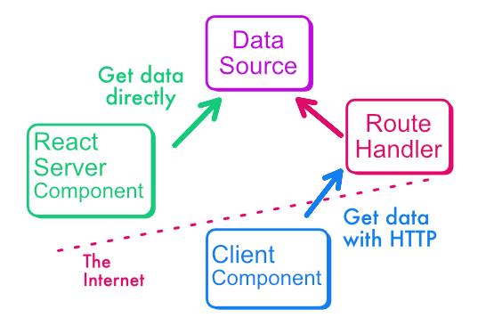

## Mixing static and client-side rendering with "relaying"

In web application development, choosing the right rendering technology greatly influences the speed, scalability, and overall user experience of the application.

While static rendering is the fastest and most affordable rendering method, it doesn't always serve the interactive needs of modern web applications. 

In previous lessons, we have tried to keep static rendering around as much as possible, because that’s the cheapest and fastest approach for rendering content. It scales almost infinitely, and yet we can have always fresh data.

Now, it doesn’t mean that we should not use the other rendering approaches. Better, we could mix static and client or dynamic rendering. 

This module is dedicated to static + client-side rendering and explains a pattern I call “relaying”.

## Server rendering (static or dynamic) implies a page refresh

One limitation of static rendering is that the user must reload the page to get new content. That's actually also true for dynamic rendering, since both happens on the server.

Client-side data fetching can bypass this limitation, and updates the data regularly with JavaScript in the browser.

## Use cases for client-side refresh

You may think you’re are teaching your users to be very lazy here. Refreshing the page only requires a click! 

But when a good call to action like our preorder counts increases your conversion ratio by 10 points, you certainly want to remove the need for a page refresh.

Hopefully, there are also less “cynical” use cases! Maybe you want to build a real-time chat, or an auto-updating dashboard.

## Client-side data fetching (and rendering) in React

If you are already an experimented React user, you may already be familiar with client-side data fetching.

The base idea is to combine `useEffect` to trigger an asynchronous call (remember that client-side React cannot use “async” directy (yet), only RSC can), `useState` to store the data, and `fetch` for the actual request.

:::tip
The [new React documentation](https://react.dev/reference/react/useEffect#fetching-data-with-effects) showcase an example of this pattern that includes a step we always forget: cleaning up the effect! You might want to take a look at the reusable [“useData” hook](https://react.dev/learn/you-might-not-need-an-effect).
:::

## Use a lib!

React documentation also encourages React users to delegate data fetching to a library. 

Because data fetching involves many complicated steps:
- The cleanup step I’ve mentioned just above, when the component is unmounted (removed from screen) in the middle of a request
- But also caching so that multiple components do not fetch the same data again and again
- And if we involve caching, we also need cache invalidation (cache invalidation is one of Phil Karlton famous “2 hard things in computer science”!)
- Etc.

It’s cool to learn how to handle all those problems, but in a professional context, you want to delegate those tasks to a library.

## SWR from Vercel

[SWR](https://swr.vercel.app/fr-FR) is a library for client-side data fetching maintained by Vercel, it’s light and simple, and integrate well with React. I’ll be honest: I love it.

:::note
Client-side data fetching implies that you create an API route. That’s a downside compared to RSC, that can talk to the database directly. Server-side data fetching is still recommended when you don't need to fetch new data interactively.
:::



Using SWR is relatively intuitive, see this snippet I've already shared in a previous lesson:

```tsx
// src/components/preorder-section.tsx
const { data , error, isLoading } = 
  useSWR<{ count: number }>(
    '/api/preorder/count',
    jsonFetch,
  )
return (<p>
    Join the other {data.count} customers 
    who have already preordered.
  </p>)
```
:::note
The second parameter of `useSWR` is the "fetcher" function. In many apps, it's just a `fetch` call with the proper headers for JSON calls. 

But you can also adapt to support other use cases: downloading a file, calling a GraphQL API, etc.
:::

## Sharing Route Handlers and RSCs data fetching logic

Next.js Route Handlers and RSC use roughly the same syntax and functions, so you can share most of the database communication logic between the API endpoint and any RSC that gets the same data.

:::warning
Something that trips many beginners is that an RSC cannot call a Route Handler via HTTP. 

That’s because your own API is not running during build-time. It was already true with older “getStaticProps” and “getServerSideProps” methods and API Routes in Next 12. 

To bypass this issue, you simply need to reuse the code of the Route Handler in your RSC, instead of calling it via HTTP.
:::

In the next lesson we will do the actual mix between static and client-side rendering.
