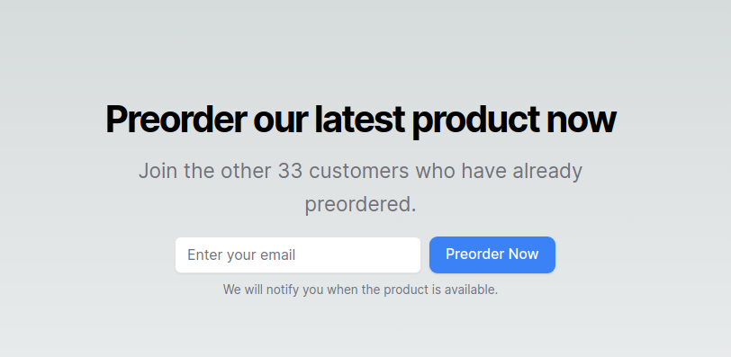
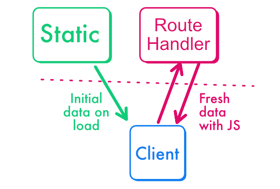

## Two places ("where") to get data: client and server

Here is a screenshot of the preorder form in our Newline Commerce demo app. It includes a call-to-action that displays the current number of preorders.
The count should update anytime a user preorders the product.



We can get the preorders count server-side and/or client-side.

- Server-side, it’s fast and immediate, but it doesn’t update without a page refresh.
- Client-side, we need to wait for the page to load, the request to be triggered, and the response to be obtained. This means there will be some loading time.

:::note
You'll sometimes hear about "cascading": when using client-side data fetching, data are fetched only when the JavaScript code is fetched and loaded.
This means data are fetched one step at a time, forming a "cascade", rather than in one go when the user accesses the page.
:::

## Relaying with SWR

What I call **“relaying”** is using the server-side value for a first render, and then using the client-side value when it’s ready.




SWR can do that easily using “fallback” argument.
The fallback will be used until client-side data can be fetched.

```tsx
const { data/ } = useSWR<{ count: number }>(
    '/api/preorder/count',
    jsonFetch,
    {
      // "Relaying" with fallback data
      fallbackData: { count: initialCount },
    })
```

## Polling to get fresh data on a regular interval

Polling then allows to repeat the client-side data fetching regularly. Users will never see a loader. With SWR, it can be enabled using the `refreshInterval` option.

```tsx
const { data } = useSWR<{ count: number }>(
    '/api/preorder/count',
    jsonFetch,
    {
      fallbackData: { count: initialCount },
      // Polling every 2 seconds
      refreshInterval: 2000
    })
```

SWR makes a point to avoid loaders, and actually takes its name from the “Stale-While-Revalidate” caching strategy, initially designed for the HTTP cache. 

It’s all in the name. When SWR notices that new data are needed, because you told it so using the `mutate` function, or when polling is on, it will behave like so:

1) It keeps displaying the old value (“stale”), which is better than nothing or a loader.
2) It starts getting the new data in the background (“revalidate”).
3) It shows the result when fresh data are there.

Calling the old data “stale” is an exaggeration, on the contrary, with this pattern, user always see the freshest available data.

## Update the value instantaneously for the user who triggered the mutation

Polling let's us update the value regularly, when other users are preordering the product.

But when the current user is preordering, we want the count to increase immediately, not after a polling interval.

Therefore, there is a final catch: when the user submits the preorder forms, we also need to tell SWR to immediately get a new value when the user preorders.

Otherwise they might see a truly stale value: the server value is in advance compared to the client value, so the preorder counts will show 5 (server fallback), then 4 (value cached by the client) then 5 (polled client value).

In the code below the “mutate” call tells SWR to forget the current value (4) and prevents this annoying value jump. 

This call is only needed for the user that submits the form, not the other users that see the preorder count increase but didn’t submit the form yet. Those will get a fresh value after the polling interval.

```tsx
// src/components/preorder-section.tsx
<form className="flex space-x-2"
   onSubmit={async (evt) => {
     evt.preventDefault()
     await createPreorderAction(new FormData(evt.target as HTMLFormElement))
     // forces SWR to immediately refetch data
     mutate("/api/preorder/count")
   }}
 >
```

:::note
We need to call the Server Action manually in “onSubmit”, rather than using the `action` attribute. 
It’s not clear yet if a React transition is mandatory here, see [this issue for up-to-date information.](https://github.com/vercel/next.js/issues/57652#issuecomment-1783911632)
:::

## Check Point

In previous modules, we have learnt to use static rendering efficiently to show fresh data on page load.

Thanks to relaying, we can now mix static rendering and client-side rendering to update the data in real-time, without even needing a page refresh.

This is great for our call-to-action but can also be useful for collaborative applications or any component that would benefit from quasi-real-time updates.
